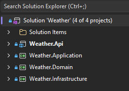

# Weather API project

## Description
This project is a simple Weather API built using ASP.NET Core 10. 

It provides endpoints to retrieve weather information for cities (_Bratislava, Praha, Budapest, Vienna_). 
The API is designed to be lightweight and easy to use, 
making it ideal for developers who want to integrate weather data into their applications.

## Mission
The mission of this project is to provide accurate and up-to-date weather information 
to users in a simple and efficient manner.

[net-zadanie-2026.pdf](./net-zadanie-2026.pdf): in slovak language, contains the task description and requirements for the project.

## Get
To get the project, you can clone the repository from GitHub using the following command:
```bash
git clone https://github.com/peterbocej/Weather.git
```
## Solution items

* #### Weather.API
This is the main project of the solution, which contains the API implementation.
* #### Weather.Application
This project contains the application logic and services used by the API.
* #### Weather.Domain
This project contains the domain models and entities used in the application.
* #### Weather.Infrastructure
This project contains the infrastructure code, such as database access and external API integrations.
## Prepare
To prepare the project for development, you need to have .NET 8.0 SDK installed on your machine.

1. Open Weather.slnx in Visual Studio.
2. Restore NuGet packages.
3. Rebuild solution to restore all dependencies and ensure that the project is set up correctly.

## Run
- Register for a free API key at [Weather API](https://www.weatherapi.com/) to access weather data.
- In _appsettings.json_ file of the Weather.API project, replace the placeholder YOUR_API_KEY in _AppSettings->WeatherApiServer->ApiKey_ with your actual API key.
- In _appsettings.json_ file of the Weather.API project, replace the placeholder JWT_KEY in _AppSettings->Jwt->Key_ with a secure key of your choice for JWT authentication.
- Set _AppSettings->Cache->Mode_ to "None", "Memory", or "Database" based on your preference.
- Run _Weather.API_ project (with http, https or Container settings) to start the API server.
- Register new user by sending a POST request to _/api/auth/register_ endpoint with the required user details in the request body. Use role _User_ or _Administrator_.
- Authenticate by sending a POST request to _/api/auth/login_ endpoint with the user credentials in the request body.
- Use response from the login endpoint to obtain a JWT token, which will be used for authenticated requests to the API.
- Get weather information for a city by sending a GET request to _/api/temperature/{cityId}_ endpoint, replacing {city} with the number of the desired city. Include the JWT token in the Authorization header of the request.